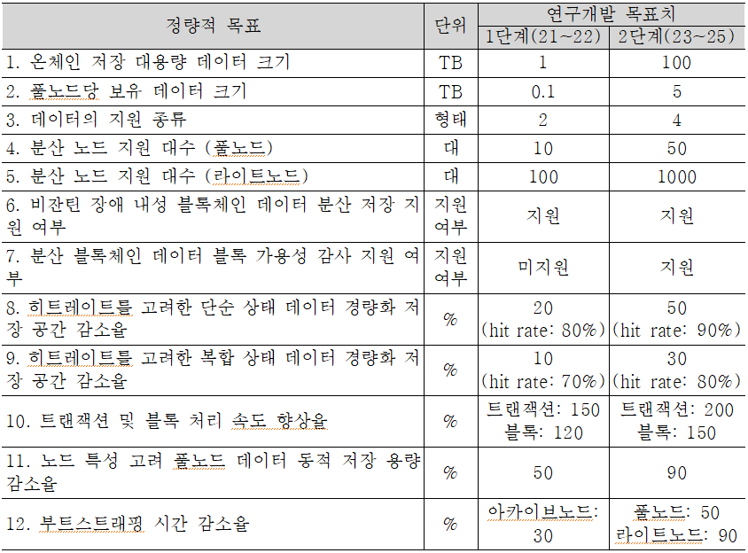
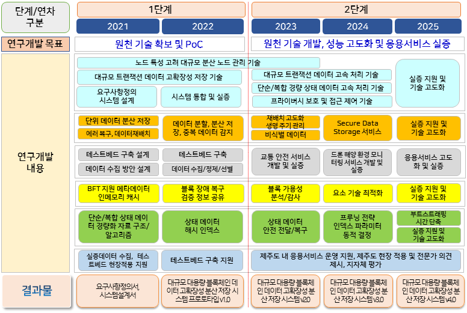
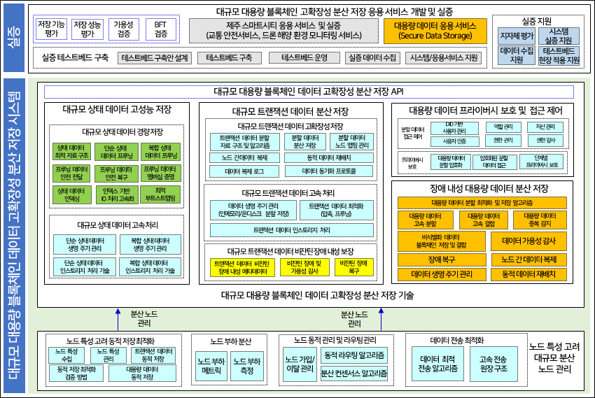

# BBS (Big Blockchain Storage) Project
* 과제 기간: 2021.04.01 ~ 2025.12.31 (5년)
* 주관 기관: 한국전자통신연구원
* 참여 기관
  - 아이콘루프
  - 시티랩스
  - 포항공대
  - 서울대
  - 제주도
  
## 과제 개념도
  

## 최종 목표
비잔틴 장애 내성을 보장하면서 대규모 트랜잭션 데이터(1TB 이상)를 분산 저장하고, 대용량 데이터(100TB 이상)를 온체인 분산 저장하고 주권을 보장하여, 다양한 산업 분야 활용성을 증대하는 대규모 대용량 블록체인 데이터 고확장성 분산 저장 시스템 개발
* BFT 보장 대규모 트랜잭션 데이터 고확장성 분산저장 및 고속처리 기술
* 대규모 상태 데이터 경량 저장 및 고속 처리 기술
* 장애 내성 대용량 데이터 분산저장 및 프라이버시보호 및 접근제어 기술

## 주요 정량적 목표

## 연구 내용
* [노드 특성 고려 대규모 분산 노드 관리 기술] 라이트, 풀, 아카이브 등 다양한 블록체인 네트워크 참여 노드의 컴퓨팅 능력을 고려하여 블록체인 데이터를 관리할 수 있도록 대규모 분산 블록체인 노드를 관리하는 기술 

* [비잔틴 장애 내성 보장 대규모 트랜잭션 데이터 고확장성 분산 저장 기술] 1/3 노드까지 비잔틴 장애를 허용하고 노드 특성을 고려하면서 대규모 트랜잭션 데이터를 분산 저장하고, 인스토리지 처리를 통해 고속 트랜잭션 처리를 지원하는 고확장성 분산 저장 기술

* [데이터 무결성, 가용성, 주권 보장 대용량 데이터 분산 저장 기술] 다양한 산업 분야 활용성 증대를 위해 다양한 분야의 디지털 데이터, 디지털화된 현물 데이터 및 기업 데이터를 블록체인을 이용하여 관리하여, 데이터 무결성, 가용성, 소유권을 보장하기 위한 대용량 데이터 분산 저장 기술

* [대규모 상태 데이터 경량 저장 및 고속 처리 기술] 경량 저장, 인스토리지 처리를 통해 블록체인에 저장된 트랜잭션 데이터의 최신 상태를 고속으로 접근할 수 있도록 하는 대규모 상태 데이터 경량 고속 저장 및 처리 기술

* [데이터 주권 보장을 위한 프라이버시 보호 및 역할 기반 접근 제어 기술] 블록체인에 관리되는 대용량 데이터의 프라이버시를 보호하고, 데이터 소유자의 주권 보장을 위해 역할 기반 접근 제어를 제공하는 프라이버시 보호 및 접근 제어 기술

* [대규모 대용량 블록체인 데이터 고확장성 분산 저장 응용 서비스 실증] 대규모 대용량 블록체인 데이터 고확장성 분산 저장 시스템의 기능, 성능, 안정성, 유용성을 검증하기 위한 응용 서비스 개발 및 실증

## 기술 개발 로드맵

## 시스템 구조도

